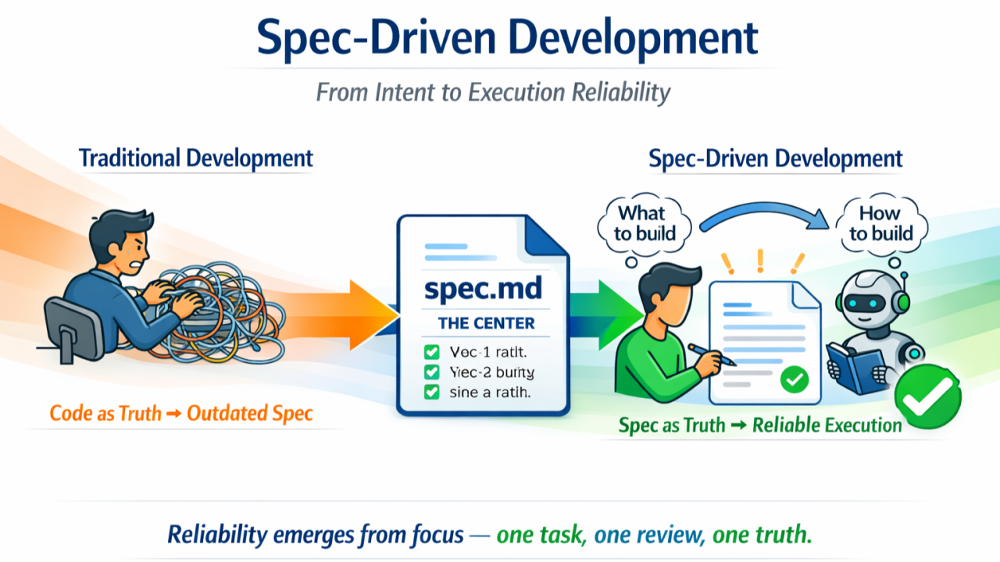

# testproject

A React web application created from the official [Vite](https://vite.dev/) `react-ts` template, used to show spec-driven development with Spec Kit.



## Development workflow

Every change goes from a Jira ticket to a spec, then to a plan and code made with GitHub Copilot, and is merged through a reviewed pull request. The binding rules are in the [constitution](.specify/memory/constitution.md).

```mermaid
flowchart LR
  J["Jira ticket<br/>business requirement"] -->|"key + text"| B["Branch<br/>feature/FIN-123-name<br/>or bug/FIN-123-name"]
  B --> S["/speckit-specify<br/>specs/FIN-123-feature/spec.md"]
  S -.->|optional| R["Spec review<br/>developer edits spec"]
  S --> P["Plan in chat<br/>Plan mode + Constitution Check<br/>developer approves"]
  R -.-> P
  P --> I["Implement in chat<br/>Agent mode, code + tests + docs<br/>PR description drafted"]
  I --> C["Commit & push<br/>by developer"]
  C --> PR["Pull request<br/>opened by Copilot on request<br/>spec + code, template filled"]
  PR --> CI["CI checks<br/>lint, format, types, tests, build, audit"]
  PR --> CR["Copilot code review<br/>copilot-instructions.md"]
  CI --> H["Developer review<br/>and approval"]
  CR --> H
  H --> M["Merge to main"]
```



1. **Jira ticket**: The business requirement and its acceptance criteria are written in Jira.
2. **Branch**: Create a branch named after the ticket type and key: `feature/FIN-123-short-name` or `bug/FIN-123-short-name`.
3. **Spec**: In Copilot chat, run `/speckit-specify` with the ticket key and text. Copilot writes `specs/FIN-123-feature/spec.md` with user stories, acceptance scenarios, requirements and documentation impact, but no technical design.
4. **Spec review (optional)**: The developer reads the spec and edits it if needed.
5. **Plan**: In Plan mode, ask Copilot for an implementation plan based on the spec. The plan includes a check against the constitution and justifies any new dependency or abstraction. The developer approves the plan before any code is written.
6. **Implement**: Switch to Agent mode and let Copilot implement the approved plan with tests. Copilot updates the [documentation](#documentation) listed in the spec's Documentation Impact, verifies the acceptance scenarios, sets the spec's `**Status**:` to `Implemented`, and drafts the PR description from the [template](.github/pull_request_template.md): Jira key, spec link, plan summary, any added complexity and changed docs.
7. **Commit and push**: The developer commits the spec and code together and pushes the branch.
8. **Pull request**: The developer asks Copilot in chat to open the PR (e.g. "open the pull request"). Copilot opens it with the drafted description and never does so on its own. Alternatively, the developer opens the PR and pastes the draft over the pre-filled template.
9. **Automated checks**: [CI](.github/workflows/ci.yml) runs lint, format check, type-check, tests (including the configuration documentation check), build and dependency audit. Copilot code review checks the PR against [copilot-instructions.md](.github/copilot-instructions.md) and the constitution.
10. **Developer review**: A developer reviews the spec and code together, resolves Copilot's comments, approves and merges.

## Documentation

Every change updates the documentation in the same pull request.

- [Technical documentation](docs/technical/README.md) (internal): every configuration option the app reads, in [configuration.md](docs/technical/configuration.md). A test fails CI if an option is missing or outdated.
- [Product documentation](docs/product/README.md) (external): user-facing features and their flows, in plain language with Mermaid diagrams.

The spec template ([override](.specify/templates/overrides/spec-template.md)) has a mandatory Documentation Impact section that states which docs a feature changes.

## Prerequisites

- [Node.js](https://nodejs.org/) current LTS (minimum 20.19+ or 22.12+, as required by Vite)
- npm (bundled with Node.js)

## Getting started

All commands run from the `app/` folder:

```sh
cd app
npm install
npm run dev
```

The dev server prints the local address (default <http://localhost:5173>). It listens on localhost only. If the port is in use, it picks the next free port and prints it. Saved changes appear in the browser without a restart. Press `Ctrl+C` to stop.

## Commands

| Command                | Purpose                                      |
| ---------------------- | -------------------------------------------- |
| `npm install`          | Install dependencies                         |
| `npm run dev`          | Start the local development server           |
| `npm run lint`         | Lint the code (Oxlint)                       |
| `npm run typecheck`    | Type-check in TypeScript strict mode         |
| `npm test`             | Run automated tests (Vitest)                 |
| `npm run build`        | Create a production build in `app/dist`      |
| `npm run format:check` | Check formatting (Prettier)                  |
| `npm run format`       | Fix formatting                               |
| `npm run preview`      | Serve the production build locally           |
