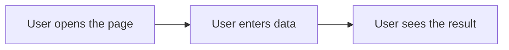

# Product documentation

Documentation for people who use testproject.

## Features

No user-facing features yet.

## Writing feature pages

- Write one page per feature, named after the feature, e.g. `sign-in.md`, and link it under Features above.
- Write in plain language for external readers. Leave out internal details such as code, configuration, infrastructure and ticket numbers.
- Describe what the feature does and who it is for, then each flow step by step.
- Draw each flow as a Mermaid diagram:

