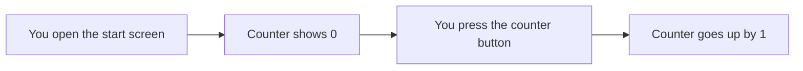
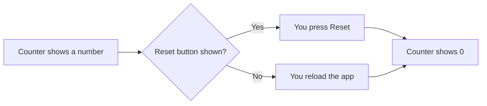

# Counter

The start screen has a counter. Use it to count how many times you press a button, and start again from zero when you need to.

## Count

When you open the app, the counter shows 0. Each press of the counter button adds 1. The count is not saved: it starts at 0 again every time you open the app.

## Reset the count

Next to the counter there can be a **Reset** button. Press it to set the count back to 0 at once. There is no confirmation. After a reset, the counter counts up from 0 again.

The Reset button is not available in every version of the app. If you don't see it, reload the app to count from 0 again.

