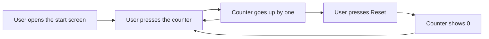

# Reset the counter

The start screen has a counter. Each time you press it, the number goes up by one. The Reset button sets the counter back to 0, so you can start counting again without reloading the page.

The Reset button is not available in every installation. If you don't see it, your installation doesn't offer it.

## Reset the counter

1. Open the start screen. The counter shows "Count is 0".
2. Press the counter one or more times. The number goes up by one with each press.
3. Press **Reset**. The counter shows "Count is 0" right away.
4. Press the counter again to count up from 0.

You can also reach the Reset button with the Tab key and press it with Enter or Space.

The counter is not saved. It starts at 0 each time you open or reload the page.
